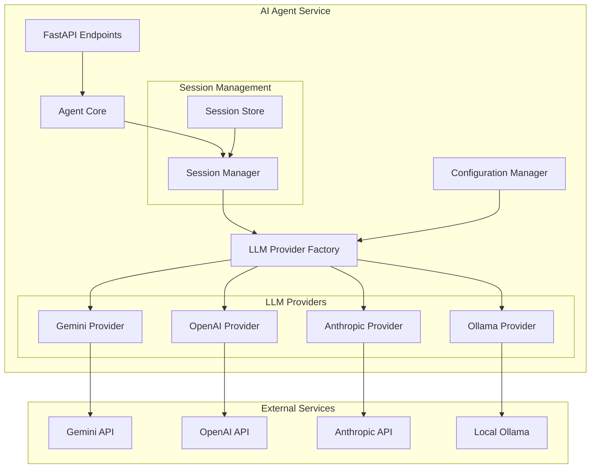
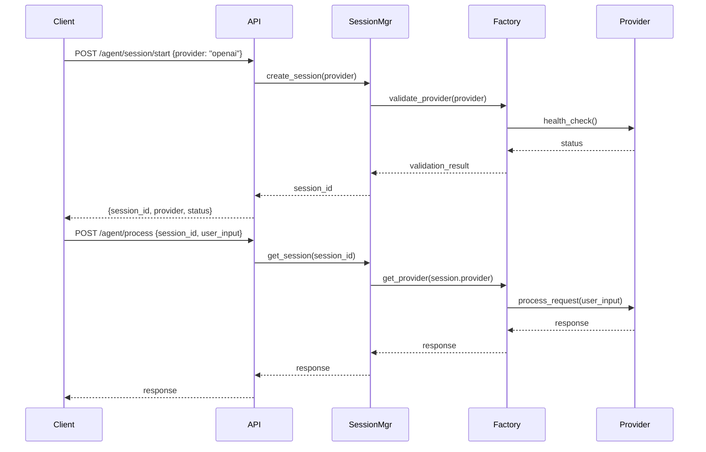

# Design Document

## Overview

The multi-LLM support enhancement introduces a provider abstraction layer that enables the AI Agent MCP Service to work with multiple Large Language Model providers (Gemini, OpenAI, Anthropic, and Ollama) while maintaining session-based provider selection and backward compatibility. The design follows a factory pattern with a unified interface, allowing for clean separation of concerns and easy extensibility.

## Architecture

### High-Level Architecture



### Provider Selection Flow



## Components and Interfaces

### 1. LLM Provider Interface

```python
from abc import ABC, abstractmethod
from typing import Dict, Any, Optional, List
from dataclasses import dataclass

@dataclass
class LLMResponse:
    success: bool
    response: str
    source: str
    tokens_used: Optional[int] = None
    model: Optional[str] = None
    error: Optional[str] = None

@dataclass
class ProviderCapabilities:
    max_tokens: int
    supports_streaming: bool
    supports_functions: bool
    supported_languages: List[str]
    cost_per_token: Optional[float] = None

class LLMProvider(ABC):
    """Abstract base class for all LLM providers"""
    
    @abstractmethod
    def __init__(self, config: Dict[str, Any]):
        """Initialize provider with configuration"""
        pass
    
    @abstractmethod
    async def generate_response(
        self, 
        prompt: str, 
        context: Optional[Dict[str, Any]] = None,
        max_tokens: int = 1000,
        temperature: float = 0.7
    ) -> LLMResponse:
        """Generate response from the LLM"""
        pass
    
    @abstractmethod
    async def analyze_intent(self, user_input: str) -> Dict[str, Any]:
        """Analyze user intent for task management"""
        pass
    
    @abstractmethod
    def is_available(self) -> bool:
        """Check if provider is available and configured"""
        pass
    
    @abstractmethod
    def get_capabilities(self) -> ProviderCapabilities:
        """Get provider capabilities and limitations"""
        pass
    
    @abstractmethod
    async def health_check(self) -> Dict[str, Any]:
        """Perform health check on the provider"""
        pass
```

### 2. Provider Factory

```python
class LLMProviderFactory:
    """Factory for creating and managing LLM providers"""
    
    def __init__(self, config_manager: ConfigManager):
        self.config_manager = config_manager
        self._providers: Dict[str, LLMProvider] = {}
        self._provider_classes = {
            'gemini': GeminiProvider,
            'openai': OpenAIProvider,
            'anthropic': AnthropicProvider,
            'ollama': OllamaProvider
        }
    
    async def initialize_providers(self) -> Dict[str, bool]:
        """Initialize all configured providers"""
        pass
    
    def get_provider(self, provider_name: str) -> LLMProvider:
        """Get a specific provider instance"""
        pass
    
    def list_available_providers(self) -> List[str]:
        """List all available and configured providers"""
        pass
    
    async def validate_provider(self, provider_name: str) -> bool:
        """Validate that a provider is available and working"""
        pass
```

### 3. Session Manager

```python
@dataclass
class LLMSession:
    session_id: str
    provider_name: str
    created_at: datetime
    last_used: datetime
    context: Dict[str, Any]
    
class SessionManager:
    """Manages LLM provider sessions"""
    
    def __init__(self, provider_factory: LLMProviderFactory):
        self.provider_factory = provider_factory
        self.sessions: Dict[str, LLMSession] = {}
    
    async def create_session(
        self, 
        provider_name: str, 
        context: Optional[Dict[str, Any]] = None
    ) -> str:
        """Create a new session with specified provider"""
        pass
    
    def get_session(self, session_id: str) -> Optional[LLMSession]:
        """Get session by ID"""
        pass
    
    async def process_request(
        self, 
        session_id: str, 
        user_input: str, 
        context: Optional[Dict[str, Any]] = None
    ) -> LLMResponse:
        """Process request using session's provider"""
        pass
    
    def cleanup_expired_sessions(self, max_age_hours: int = 24):
        """Clean up expired sessions"""
        pass
```

### 4. Configuration Manager

```python
class LLMConfig:
    """Configuration for LLM providers"""
    
    def __init__(self):
        self.providers = {
            'gemini': {
                'api_key': os.getenv('GEMINI_API_KEY'),
                'model': os.getenv('GEMINI_MODEL', 'gemini-pro'),
                'enabled': bool(os.getenv('GEMINI_API_KEY'))
            },
            'openai': {
                'api_key': os.getenv('OPENAI_API_KEY'),
                'model': os.getenv('OPENAI_MODEL', 'gpt-3.5-turbo'),
                'enabled': bool(os.getenv('OPENAI_API_KEY'))
            },
            'anthropic': {
                'api_key': os.getenv('ANTHROPIC_API_KEY'),
                'model': os.getenv('ANTHROPIC_MODEL', 'claude-3-sonnet-20240229'),
                'enabled': bool(os.getenv('ANTHROPIC_API_KEY'))
            },
            'ollama': {
                'base_url': os.getenv('OLLAMA_BASE_URL', 'http://localhost:11434'),
                'model': os.getenv('OLLAMA_MODEL', 'llama2'),
                'enabled': bool(os.getenv('OLLAMA_ENABLED', 'false').lower() == 'true')
            }
        }
    
    def get_provider_config(self, provider_name: str) -> Dict[str, Any]:
        """Get configuration for specific provider"""
        pass
    
    def get_enabled_providers(self) -> List[str]:
        """Get list of enabled providers"""
        pass
```

## Data Models

### Provider-Specific Implementations

#### Gemini Provider
- Refactored from existing `GeminiClient`
- Maintains all current functionality
- Implements new `LLMProvider` interface
- Handles Google-specific safety settings

#### OpenAI Provider
- Uses OpenAI Python SDK
- Supports GPT-3.5-turbo and GPT-4 models
- Implements function calling capabilities
- Handles OpenAI-specific rate limiting

#### Anthropic Provider
- Uses Anthropic Python SDK
- Supports Claude models
- Implements Anthropic's message format
- Handles Anthropic-specific safety features

#### Ollama Provider
- HTTP client for local Ollama instances
- Dynamic model discovery and selection
- Supports model switching within sessions
- Handles local connectivity and model availability

### Session Storage

```python
# In-memory session storage (can be extended to Redis/Database)
class SessionStore:
    def __init__(self):
        self.sessions: Dict[str, LLMSession] = {}
        self.session_lock = asyncio.Lock()
    
    async def store_session(self, session: LLMSession):
        """Store session data"""
        pass
    
    async def get_session(self, session_id: str) -> Optional[LLMSession]:
        """Retrieve session data"""
        pass
    
    async def delete_session(self, session_id: str):
        """Delete session data"""
        pass
```

## Error Handling

### Provider-Specific Error Handling

1. **Authentication Errors**: Clear messages without exposing keys
2. **Rate Limiting**: Graceful handling with retry logic
3. **Network Errors**: Timeout and connection error handling
4. **Model Errors**: Invalid model or parameter handling
5. **Session Errors**: Invalid session or expired session handling

### Error Response Format

```python
@dataclass
class ErrorResponse:
    error_code: str
    message: str
    provider: Optional[str] = None
    session_id: Optional[str] = None
    details: Optional[Dict[str, Any]] = None
```

### Fallback Strategies

1. **Session-Level**: No fallback within session (requirement 9.4)
2. **System-Level**: Health checks and provider validation
3. **Graceful Degradation**: Rule-based responses when all providers fail

## Testing Strategy

### Unit Tests

1. **Provider Interface Tests**: Test each provider implementation
2. **Factory Tests**: Test provider creation and management
3. **Session Manager Tests**: Test session lifecycle and management
4. **Configuration Tests**: Test configuration loading and validation

### Integration Tests

1. **End-to-End Session Flow**: Test complete session workflow
2. **Provider Switching**: Test session isolation
3. **Error Handling**: Test various failure scenarios
4. **Health Check Integration**: Test system health monitoring

### Mock Testing

1. **External API Mocking**: Mock all external LLM APIs
2. **Network Failure Simulation**: Test connectivity issues
3. **Rate Limiting Simulation**: Test rate limit handling
4. **Authentication Failure Testing**: Test invalid credentials

### Performance Tests

1. **Concurrent Sessions**: Test multiple simultaneous sessions
2. **Provider Performance**: Compare response times across providers
3. **Memory Usage**: Test session storage and cleanup
4. **Load Testing**: Test system under high request volume

## Security Considerations

### API Key Management
- Environment variable storage only
- No API keys in logs or responses
- Secure configuration validation

### Session Security
- Session ID generation using secure random
- Session timeout and cleanup
- No sensitive data in session storage

### Provider Communication
- HTTPS for all external providers
- Local network security for Ollama
- Request/response sanitization

## Migration Strategy

### Backward Compatibility
1. Existing Gemini-only configurations continue to work
2. No changes to existing API endpoints
3. Gradual migration path for existing users

### Deployment Strategy
1. Feature flag for multi-LLM support
2. Gradual rollout with monitoring
3. Rollback capability if issues arise

### Configuration Migration
1. Automatic detection of existing Gemini config
2. Optional migration to new session-based approach
3. Documentation for configuration updates