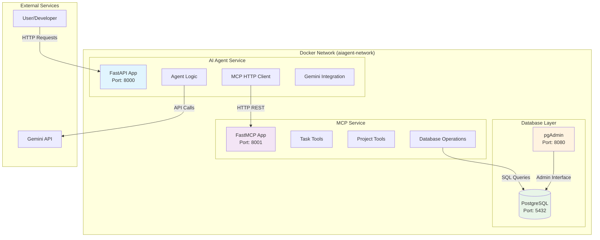

# AI Agent MCP Service Learning Project

A comprehensive learning project focused on **Model Context Protocol (MCP)** service development and AI agent integration. This project demonstrates how to build AI agents that interact with MCP services for task and project management using FastAPI, Docker, and PostgreSQL.

## 🎯 Learning Objectives

- **MCP Development**: Build HTTP-based MCP services using FastAPI/FastMCP
- **AI Agent Integration**: Create agents using Gemini API for natural language processing
- **Containerization**: Learn Docker best practices for AI services
- **Database Integration**: Implement PostgreSQL for data persistence
- **Multi-service Architecture**: Master orchestration patterns with Docker Compose

## 🏗️ Architecture Overview

This project follows a microservices architecture with four containerized services orchestrated through Docker Compose:



### Service Communication Flow

1. **User Request** → AI Agent Service (FastAPI) on port 8000
2. **AI Agent** → Gemini API for natural language processing
3. **AI Agent** → MCP Service via HTTP REST calls on port 8001
4. **MCP Service** → PostgreSQL for data operations on port 5432
5. **pgAdmin** → Database administration interface on port 8080
6. **Response** flows back through the chain to the user

## 🚀 Quick Start

### Prerequisites

- **Docker & Docker Compose**: [Install Docker](https://docs.docker.com/get-docker/)
- **Gemini API Key**: Get from [Google AI Studio](https://makersuite.google.com/app/apikey)
- **Git**: For cloning the repository
- **Python 3.8+**: For running development scripts (optional)

### 5-Minute Setup

1. **Clone and navigate to the project:**
   ```bash
   git clone <repository-url>
   cd ai-agent-mcp-service
   ```

2. **Configure environment variables:**
   ```bash
   cp .env.example .env
   ```
   
   **Edit `.env` file with your credentials:**
   ```env
   # Required: Get from https://makersuite.google.com/app/apikey
   GEMINI_API_KEY=your_actual_gemini_api_key_here
   
   # Database credentials (change from defaults for security)
   POSTGRES_PASSWORD=your_secure_password_here
   PGADMIN_DEFAULT_PASSWORD=your_admin_password_here
   ```

3. **Start all services:**
   ```bash
   docker-compose up -d
   ```

4. **Verify setup (wait ~30 seconds for startup):**
   ```bash
   # Quick status check
   docker-compose ps
   
   # Run comprehensive health checks
   python scripts/health_check.py
   ```

5. **Access services:**
   - **AI Agent API**: http://localhost:8000 (FastAPI docs at `/docs`)
   - **MCP Service API**: http://localhost:8001 (FastMCP tools)
   - **pgAdmin**: http://localhost:8080 (database admin interface)
   - **PostgreSQL**: localhost:5432 (direct database access)

### Verification Commands

```bash
# Test AI Agent Service
curl http://localhost:8000/health
curl http://localhost:8000/agent/status

# Test MCP Service
curl http://localhost:8001/health

# Test database connectivity
docker-compose exec postgres psql -U postgres -d aiagent_mcp -c "SELECT version();"

# Run all development tests
python scripts/run_all_tests.py
```

## 📁 Project Structure

```
├── ai-agent-service/          # AI Agent FastAPI service (Port 8000)
│   ├── main.py               # FastAPI application entry point
│   ├── requirements.txt      # Python dependencies
│   ├── Dockerfile           # Container configuration
│   └── app/                 # Application modules
│       ├── agent/           # AI agent logic
│       ├── mcp_client/      # MCP service HTTP client
│       └── models/          # Data models
│
├── mcp-service/              # MCP Service FastAPI service (Port 8001)
│   ├── main.py              # FastAPI/FastMCP application
│   ├── requirements.txt     # Python dependencies  
│   ├── Dockerfile          # Container configuration
│   └── app/                # Application modules
│       ├── tools/          # MCP tool implementations
│       ├── database/       # Database operations
│       └── models/         # Data models
│
├── database/                # Database setup and scripts
│   ├── init.sql            # Database initialization
│   ├── test_data.sql       # Sample data insertion
│   └── schema/             # Database schema definitions
│
├── docker-compose.yml      # Service orchestration
├── .env.example           # Environment configuration template
└── README.md             # This file
```

## 🛠️ Development Commands

### Docker Operations
```bash
# Start all services
docker-compose up -d

# View logs for all services
docker-compose logs -f

# View logs for specific service
docker-compose logs -f ai-agent

# Stop all services
docker-compose down

# Rebuild and restart services
docker-compose up --build

# Remove all containers and volumes
docker-compose down -v
```

### Service Health Checks
```bash
# AI Agent Service
curl http://localhost:8000/health
curl http://localhost:8000/agent/status

# MCP Service
curl http://localhost:8001/health

# Check all service health with Python script
python scripts/health_check.py

# Monitor Docker container status
./scripts/docker_status.sh
```

## 🏥 Health Monitoring & Orchestration

The project includes comprehensive health monitoring and service orchestration:

### Automated Health Checks
- **AI Agent Service**: HTTP health endpoint with 30s intervals
- **MCP Service**: HTTP health endpoint with 30s intervals  
- **PostgreSQL**: Database readiness checks with `pg_isready`
- **pgAdmin**: Web interface ping checks

### Service Dependencies
Services start in proper order based on health status:
1. PostgreSQL (database foundation)
2. MCP Service (waits for healthy database)
3. AI Agent Service (waits for healthy MCP service)
4. pgAdmin (waits for healthy database)

### Monitoring Tools
- **Health Check Script**: `python scripts/health_check.py`
- **Docker Status Monitor**: `./scripts/docker_status.sh`
- **Service Logs**: `docker-compose logs -f [service]`

### Persistent Storage
- **PostgreSQL Data**: Persistent volume for database storage
- **pgAdmin Config**: Persistent volume for admin settings
- **Pre-configured Connections**: pgAdmin automatically connects to PostgreSQL

For detailed orchestration information, see [Docker Orchestration Guide](docs/DOCKER_ORCHESTRATION.md).

## 🧪 Development Utilities

The project includes comprehensive development and testing utilities in the `scripts/` directory:

### Test Suite
```bash
# Run all development tests
python scripts/run_all_tests.py

# Individual test scripts
python scripts/health_check.py      # Service health checks
python scripts/test_database.py     # Database connectivity tests  
python scripts/api_examples.py      # API endpoint examples
```

### Quick Setup Verification
```bash
# Install script dependencies
pip install -r scripts/requirements.txt

# Verify entire setup after starting services
docker-compose up -d && sleep 10 && python scripts/run_all_tests.py
```

### Development Workflow
```bash
# 1. Start services
docker-compose up -d

# 2. Check status
./scripts/docker_status.sh

# 3. Run tests
python scripts/run_all_tests.py

# 4. View logs if needed
docker-compose logs -f
```

For detailed development commands and troubleshooting, see [Development Guide](docs/DEVELOPMENT_GUIDE.md).

## 🔧 Service Configuration
curl http://localhost:8001/health

# Database connection test
docker-compose exec postgres psql -U aiagent -d aiagent_mcp -c "SELECT version();"
```

### Database Management
```bash
# Connect to PostgreSQL directly
docker-compose exec postgres psql -U aiagent -d aiagent_mcp

# View database logs
docker-compose logs postgres

# Backup database
docker-compose exec postgres pg_dump -U aiagent aiagent_mcp > backup.sql

# Restore database
docker-compose exec -T postgres psql -U aiagent -d aiagent_mcp < backup.sql
```

## ⚡ Quick Start Guide for Immediate Development

### Option 1: One-Command Setup
```bash
# Clone, configure, and start everything
git clone <repository-url> && cd ai-agent-mcp-service && \
cp .env.example .env && \
echo "⚠️  Edit .env file with your GEMINI_API_KEY now!" && \
docker-compose up -d && \
sleep 30 && \
python scripts/run_all_tests.py
```

### Option 2: Step-by-Step Development Setup
```bash
# 1. Get the code
git clone <repository-url>
cd ai-agent-mcp-service

# 2. Set up environment (REQUIRED: Add your Gemini API key)
cp .env.example .env
# Edit .env: Set GEMINI_API_KEY=your_actual_key_here

# 3. Start infrastructure
docker-compose up -d

# 4. Verify everything works
python scripts/health_check.py

# 5. Start developing!
# - AI Agent Service: http://localhost:8000/docs
# - MCP Service: http://localhost:8001
# - Database Admin: http://localhost:8080
```

### Development Workflow
```bash
# Daily development routine
docker-compose up -d                    # Start services
python scripts/health_check.py          # Verify health
# ... do your development work ...
docker-compose logs -f [service]        # Check logs if needed
docker-compose down                     # Stop when done
```

### Testing Your Changes
```bash
# After making code changes
docker-compose restart [service]        # Restart specific service
python scripts/api_examples.py          # Test API endpoints
python scripts/test_database.py         # Test database operations
```

## 🔧 Configuration

### Environment Variables (.env file)

| Variable | Description | Required | Example |
|----------|-------------|----------|---------|
| `GEMINI_API_KEY` | Google Gemini API key | **Yes** | `AIzaSyC...` |
| `POSTGRES_USER` | Database username | No | `postgres` (default) |
| `POSTGRES_PASSWORD` | Database password | **Yes** | `your_secure_password` |
| `POSTGRES_DB` | Database name | No | `aiagent_mcp` (default) |
| `DATABASE_URL` | Full database connection string | Auto-generated | `postgresql://...` |
| `PGADMIN_DEFAULT_EMAIL` | pgAdmin login email | **Yes** | `admin@example.com` |
| `PGADMIN_DEFAULT_PASSWORD` | pgAdmin login password | **Yes** | `your_admin_password` |
| `MCP_SERVICE_URL` | Internal MCP service URL | No | `http://mcp-service:8001` |
| `ENVIRONMENT` | Development mode | No | `development` |

### Service Ports & URLs

| Service | Port | URL | Purpose |
|---------|------|-----|---------|
| AI Agent Service | 8000 | http://localhost:8000 | FastAPI web interface and API |
| AI Agent Docs | 8000 | http://localhost:8000/docs | Interactive API documentation |
| MCP Service | 8001 | http://localhost:8001 | FastMCP tools and endpoints |
| PostgreSQL | 5432 | localhost:5432 | Database server (direct access) |
| pgAdmin | 8080 | http://localhost:8080 | Database administration web UI |

### Getting API Keys

#### Gemini API Key (Required)
1. Visit [Google AI Studio](https://makersuite.google.com/app/apikey)
2. Sign in with your Google account
3. Click "Create API Key"
4. Copy the key to your `.env` file
5. **Important**: Keep this key secure and never commit it to version control

#### Database Credentials
- Use the defaults for development
- Change passwords for production use
- The `DATABASE_URL` is automatically constructed from individual variables

## 🧪 Testing

### Manual Testing
```bash
# Test AI Agent endpoints
curl -X GET http://localhost:8000/health
curl -X GET http://localhost:8000/agent/status

# Test MCP Service endpoints
curl -X GET http://localhost:8001/health

# Test database connectivity
docker-compose exec postgres psql -U aiagent -d aiagent_mcp -c "\dt"
```

### Sample API Requests
```bash
# Create a new project via MCP service
curl -X POST http://localhost:8001/tools/create_project \
  -H "Content-Type: application/json" \
  -d '{"name": "Test Project", "description": "A test project"}'

# List all projects
curl -X GET http://localhost:8001/tools/list_projects

# Process natural language request via AI Agent
curl -X POST http://localhost:8000/agent/process \
  -H "Content-Type: application/json" \
  -d '{"message": "Create a new task called Setup Development Environment"}'
```

## 🐛 Troubleshooting

### Quick Diagnostics

```bash
# Run comprehensive health checks
python scripts/health_check.py

# Check Docker container status
docker-compose ps

# View all service logs
docker-compose logs -f
```

### Common Issues & Solutions

#### 1. Services Won't Start

**Symptoms:**
- `docker-compose up` fails
- Containers exit immediately
- Port binding errors

**Solutions:**
```bash
# Check for port conflicts
netstat -tulpn | grep -E ':(8000|8001|5432|8080)'
# On macOS: lsof -i :8000 -i :8001 -i :5432 -i :8080

# View detailed startup logs
docker-compose up --no-daemon

# Clean and rebuild
docker-compose down -v
docker system prune -f
docker-compose up --build
```

#### 2. Database Connection Errors

**Symptoms:**
- MCP service can't connect to PostgreSQL
- "Connection refused" errors
- Database initialization failures

**Solutions:**
```bash
# Verify PostgreSQL is running and healthy
docker-compose ps postgres
docker-compose logs postgres

# Test direct database connection
docker-compose exec postgres psql -U postgres -d aiagent_mcp -c "SELECT 1;"

# Check environment variables
docker-compose exec mcp-service env | grep -E '(DATABASE|POSTGRES)'

# Reset database with fresh data
docker-compose down -v
docker-compose up postgres
# Wait for healthy status, then start other services
```

#### 3. Gemini API Errors

**Symptoms:**
- "Invalid API key" errors
- "Quota exceeded" messages
- AI agent requests failing

**Solutions:**
```bash
# Verify API key is set correctly
grep GEMINI_API_KEY .env

# Test API key manually
curl -H "Authorization: Bearer YOUR_API_KEY" \
  "https://generativelanguage.googleapis.com/v1/models"

# Check API quota and billing at https://console.cloud.google.com/
```

**Common API Key Issues:**
- API key not activated (visit Google AI Studio)
- Billing not enabled for your Google Cloud project
- API key has insufficient permissions
- API key copied with extra spaces or characters

#### 4. Health Check Failures

**Symptoms:**
- Services show as "unhealthy" in `docker-compose ps`
- Health check scripts report failures
- Services restart repeatedly

**Solutions:**
```bash
# Check health endpoints manually
curl -v http://localhost:8000/health
curl -v http://localhost:8001/health

# Increase health check timeout (edit docker-compose.yml)
# Change timeout from 10s to 30s for slow systems

# Check service startup time
docker-compose logs ai-agent | grep -i "started"
docker-compose logs mcp-service | grep -i "started"
```

#### 5. pgAdmin Access Issues

**Symptoms:**
- Can't access pgAdmin web interface
- Login failures
- Database connection errors in pgAdmin

**Solutions:**
```bash
# Verify pgAdmin is running
docker-compose ps pgadmin
docker-compose logs pgadmin

# Check credentials in .env file
grep PGADMIN .env

# Reset pgAdmin configuration
docker-compose down
docker volume rm $(docker volume ls -q | grep pgadmin)
docker-compose up pgadmin
```

**pgAdmin Login:**
- URL: http://localhost:8080
- Email: From `PGADMIN_DEFAULT_EMAIL` in `.env`
- Password: From `PGADMIN_DEFAULT_PASSWORD` in `.env`

#### 6. Performance Issues

**Symptoms:**
- Slow API responses
- High CPU/memory usage
- Database query timeouts

**Solutions:**
```bash
# Monitor resource usage
docker stats

# Check database performance
docker-compose exec postgres psql -U postgres -d aiagent_mcp -c "
  SELECT schemaname, tablename, n_distinct, correlation 
  FROM pg_stats WHERE schemaname = 'public';"

# Restart services to free resources
docker-compose restart

# For development, reduce health check frequency
# Edit docker-compose.yml: change interval from 30s to 60s
```

### Environment-Specific Issues

#### macOS Issues
```bash
# Docker Desktop memory limits
# Increase memory in Docker Desktop preferences to 4GB+

# Port conflicts with AirPlay Receiver (port 5000)
# This project uses different ports, but check for conflicts:
sudo lsof -i :8000 -i :8001 -i :5432 -i :8080
```

#### Windows Issues
```bash
# WSL2 integration required for Docker Desktop
# Enable WSL2 integration in Docker Desktop settings

# Line ending issues in shell scripts
# Convert scripts to Unix line endings:
dos2unix scripts/*.sh
```

#### Linux Issues
```bash
# Docker permission issues
sudo usermod -aG docker $USER
# Log out and back in

# Firewall blocking ports
sudo ufw allow 8000
sudo ufw allow 8001
sudo ufw allow 5432
sudo ufw allow 8080
```

### Advanced Troubleshooting

#### Complete System Reset
```bash
# Nuclear option: reset everything
docker-compose down -v --remove-orphans
docker system prune -a -f
docker volume prune -f
docker-compose up --build
```

#### Debug Mode
```bash
# Start services with debug logging
docker-compose -f docker-compose.yml -f docker-compose.override.yml up

# Access container shells for debugging
docker-compose exec ai-agent bash
docker-compose exec mcp-service bash
docker-compose exec postgres bash
```

#### Log Analysis
```bash
# Save logs for analysis
docker-compose logs > debug.log

# Filter logs by service
docker-compose logs ai-agent > ai-agent.log
docker-compose logs mcp-service > mcp-service.log
docker-compose logs postgres > postgres.log
```

### Getting Help

1. **Check Documentation**: Review `docs/DEVELOPMENT_GUIDE.md` for detailed commands
2. **Run Diagnostics**: Use `python scripts/health_check.py` for automated checks
3. **Check Logs**: Always start with `docker-compose logs [service-name]`
4. **Verify Environment**: Ensure `.env` file has correct values
5. **Test Incrementally**: Start services one by one to isolate issues

### Support Resources

- **Docker Issues**: [Docker Documentation](https://docs.docker.com/)
- **FastAPI Issues**: [FastAPI Documentation](https://fastapi.tiangolo.com/)
- **PostgreSQL Issues**: [PostgreSQL Documentation](https://www.postgresql.org/docs/)
- **Gemini API Issues**: [Google AI Documentation](https://ai.google.dev/docs)

## ✅ Setup Verification Checklist

After completing the setup, verify everything is working:

### 1. Container Health Check
```bash
# All containers should show "healthy" status
docker-compose ps

# Expected output:
# ai-agent     ... Up (healthy)
# mcp-service  ... Up (healthy)  
# postgres     ... Up (healthy)
# pgadmin      ... Up (healthy)
```

### 2. Service Endpoints
```bash
# All endpoints should return 200 OK
curl -s http://localhost:8000/health | grep -q "healthy" && echo "✅ AI Agent OK"
curl -s http://localhost:8001/health | grep -q "healthy" && echo "✅ MCP Service OK"
```

### 3. Database Connectivity
```bash
# Should return PostgreSQL version
docker-compose exec postgres psql -U postgres -d aiagent_mcp -c "SELECT version();"
```

### 4. Web Interfaces
- [ ] AI Agent API Docs: http://localhost:8000/docs (should load FastAPI interface)
- [ ] pgAdmin: http://localhost:8080 (should show login page)

### 5. Automated Verification
```bash
# Run comprehensive test suite
python scripts/run_all_tests.py

# Expected: All tests should pass with "✅ PASS" status
```

## 🚀 Next Steps

### For Learning MCP Development
1. **Explore MCP Tools**: Visit http://localhost:8001 to see available tools
2. **Study Code Structure**: Review `mcp-service/app/tools/` for tool implementations
3. **Test API Calls**: Use `python scripts/api_examples.py` to see MCP tools in action
4. **Modify Tools**: Try adding new MCP tools in `mcp-service/app/tools/`

### For AI Agent Development
1. **Test AI Agent**: Visit http://localhost:8000/docs to explore AI agent endpoints
2. **Study Integration**: Review `ai-agent-service/app/agent/core.py` for agent logic
3. **Experiment with Prompts**: Modify agent behavior in the core logic
4. **Add New Features**: Extend the agent with additional capabilities

### For Database Operations
1. **Explore Data**: Use pgAdmin at http://localhost:8080 to browse database
2. **Run Queries**: Test SQL queries in the pgAdmin query tool
3. **Modify Schema**: Update `database/init.sql` and rebuild containers
4. **Add Test Data**: Extend `database/test_data.sql` with more examples

### Development Workflow
```bash
# Daily development routine
docker-compose up -d                    # Start services
python scripts/health_check.py          # Verify health
# ... make your changes ...
docker-compose restart [service]        # Restart modified service
python scripts/api_examples.py          # Test your changes
docker-compose logs -f [service]        # Debug if needed
```

## 📚 Learning Resources

### Core Technologies
- [FastAPI Documentation](https://fastapi.tiangolo.com/) - Web framework for both services
- [FastMCP Framework](https://github.com/pydantic/fastmcp) - MCP service implementation
- [Model Context Protocol Specification](https://modelcontextprotocol.io/) - MCP standard
- [Google Gemini API Documentation](https://ai.google.dev/docs) - AI integration
- [Docker Compose Documentation](https://docs.docker.com/compose/) - Container orchestration

### Advanced Topics
- [PostgreSQL Documentation](https://www.postgresql.org/docs/) - Database operations
- [Pydantic Documentation](https://docs.pydantic.dev/) - Data validation and models
- [Docker Best Practices](https://docs.docker.com/develop/dev-best-practices/) - Container optimization
- [API Design Guidelines](https://restfulapi.net/) - REST API best practices

### Project-Specific Guides
- [`docs/DEVELOPMENT_GUIDE.md`](docs/DEVELOPMENT_GUIDE.md) - Detailed development commands
- [`docs/DOCKER_ORCHESTRATION.md`](docs/DOCKER_ORCHESTRATION.md) - Container orchestration details
- [`scripts/README.md`](scripts/README.md) - Development utilities documentation

## 🎓 Educational Focus

This project emphasizes:
- **KISS Principle**: Simple, understandable implementations for learning
- **Separation of Concerns**: Clear service boundaries and responsibilities
- **Practical Learning**: Real-world patterns and industry practices
- **Incremental Development**: Build complexity gradually with clear milestones
- **Best Practices**: Production-ready patterns in a learning environment

Perfect for developers learning:
- AI agent development and integration patterns
- MCP service implementation and HTTP-based tool systems
- Modern containerized microservices architectures
- FastAPI and Python web service development
- Database integration and PostgreSQL operations

## 📄 License

This project is for educational purposes. Feel free to use, modify, and learn from it.

---

**Happy Learning! 🎉**

If you encounter any issues, check the [Troubleshooting](#-troubleshooting) section or review the logs with `docker-compose logs -f`.