# AI Agent Service - UML Class Diagram

This document contains the UML class diagram for the AI Agent Service, showing the architecture and relationships between all major components.

## Class Diagram

```mermaid
classDiagram
    %% Core Agent Classes
    class AIAgent {
        -mcp_client: MCPClient
        -session_context: Dict
        -_provider_selector: ProviderSelector
        -_llm_provider: LLMProvider
        -_performance_tracker: PerformanceTracker
        +__init__()
        +get_status() Dict~str, Any~
        +process_request(user_input: str, context: Dict) Dict~str, Any~
        -_ensure_provider_initialized()
        -_analyze_intent_with_fallback(user_input: str) Dict~str, Any~
        -_execute_action(intent: Dict, user_input: str, context: Dict) Dict~str, Any~
        -_generate_response_with_fallback(user_input: str, intent: Dict, action_result: Dict, context: Dict) str
        -_handle_create_task(user_input: str, entities: Dict) Dict~str, Any~
        -_handle_list_tasks(entities: Dict) Dict~str, Any~
        -_handle_create_project(user_input: str, entities: Dict) Dict~str, Any~
        -_handle_general_query(user_input: str, context: Dict) Dict~str, Any~
    }

    %% LLM Provider Base Classes
    class LLMProvider {
        <<abstract>>
        +config: Dict~str, Any~
        +provider_name: str
        -_is_initialized: bool
        -_last_health_check: datetime
        -_health_status: ProviderStatus
        +__init__(config: Dict)
        +initialize()* bool
        +generate_response(prompt: str, context: Dict, max_tokens: int, temperature: float)* LLMResponse
        +analyze_intent(user_input: str, context: Dict)* Dict~str, Any~
        +is_available()* bool
        +get_capabilities()* ProviderCapabilities
        +health_check()* Dict~str, Any~
        +get_provider_name() str
        +cleanup()
        #_create_error_response(error_message: str, error_code: str) LLMResponse
        #_validate_config(required_keys: List~str~) bool
    }

    class GeminiProvider {
        -client: genai.GenerativeModel
        -model_name: str
        -safety_settings: Dict
        +initialize() bool
        +generate_response(prompt: str, context: Dict, max_tokens: int, temperature: float) LLMResponse
        +analyze_intent(user_input: str, context: Dict) Dict~str, Any~
        +is_available() bool
        +get_capabilities() ProviderCapabilities
        +health_check() Dict~str, Any~
        -_configure_safety_settings()
        -_handle_gemini_error(error: Exception) LLMResponse
    }

    class OpenAIProvider {
        -client: OpenAI
        -model_name: str
        +initialize() bool
        +generate_response(prompt: str, context: Dict, max_tokens: int, temperature: float) LLMResponse
        +analyze_intent(user_input: str, context: Dict) Dict~str, Any~
        +is_available() bool
        +get_capabilities() ProviderCapabilities
        +health_check() Dict~str, Any~
        -_handle_openai_error(error: Exception) LLMResponse
    }

    class AnthropicProvider {
        -client: Anthropic
        -model_name: str
        +initialize() bool
        +generate_response(prompt: str, context: Dict, max_tokens: int, temperature: float) LLMResponse
        +analyze_intent(user_input: str, context: Dict) Dict~str, Any~
        +is_available() bool
        +get_capabilities() ProviderCapabilities
        +health_check() Dict~str, Any~
        -_handle_anthropic_error(error: Exception) LLMResponse
    }

    class OllamaProvider {
        -base_url: str
        -model_name: str
        -available_models: List~str~
        +initialize() bool
        +generate_response(prompt: str, context: Dict, max_tokens: int, temperature: float) LLMResponse
        +analyze_intent(user_input: str, context: Dict) Dict~str, Any~
        +is_available() bool
        +get_capabilities() ProviderCapabilities
        +health_check() Dict~str, Any~
        +list_available_models() List~str~
        +switch_model(model_name: str) bool
        -_make_ollama_request(endpoint: str, data: Dict) Dict
    }

    %% Factory and Management Classes
    class LLMProviderFactory {
        -config_manager: ConfigManager
        -_providers: Dict~str, LLMProvider~
        -_provider_classes: Dict~str, Type~LLMProvider~~
        -_initialization_status: Dict~str, bool~
        -_health_check_interval: timedelta
        -_last_health_checks: Dict~str, datetime~
        -_discovery_paths: List~str~
        +__init__(config_manager: ConfigManager)
        +register_provider(provider_name: str, provider_class: Type~LLMProvider~)
        +initialize_providers(provider_configs: Dict) Dict~str, bool~
        +get_provider(provider_name: str) LLMProvider
        +list_available_providers() List~str~
        +validate_provider(provider_name: str) bool
        +health_check_all_providers() Dict~str, Dict~
        +get_factory_status() Dict~str, Any~
        +cleanup_all_providers()
        -_discover_providers()
        -_initialize_single_provider(provider_name: str, config: Dict) bool
    }

    class ProviderSelector {
        -factory: LLMProviderFactory
        -config_manager: ConfigManager
        -selected_provider_name: str
        -fallback_providers: List~str~
        +__init__(factory: LLMProviderFactory, config_manager: ConfigManager)
        +select_provider(provider_name: str) bool
        +get_selected_provider() LLMProvider
        +get_provider_status() Dict~str, Any~
        +get_configuration_summary() Dict~str, Any~
        +auto_select_best_provider() str
        -_validate_provider_selection(provider_name: str) bool
    }

    %% Configuration Classes
    class ConfigManager {
        +config: LLMConfig
        +__init__()
        +load_config() LLMConfig
        +reload_config()
        +validate_config() bool
        +get_provider_config(provider_name: str) ProviderConfig
        +update_provider_config(provider_name: str, config: ProviderConfig)
        -_load_from_environment() LLMConfig
        -_validate_provider_config(config: ProviderConfig) bool
    }

    class ProviderConfig {
        +name: str
        +enabled: bool
        +api_key: str
        +model: str
        +base_url: str
        +temperature: float
        +max_tokens: int
        +timeout: int
        +extra_params: Dict~str, Any~
    }

    class LLMConfig {
        +providers: Dict~str, ProviderConfig~
        +default_provider: str
        +session_timeout_hours: int
        +max_concurrent_sessions: int
        +get_enabled_providers() List~str~
        +get_provider_config(provider_name: str) ProviderConfig
        +is_provider_enabled(provider_name: str) bool
    }

    %% MCP Client Classes
    class MCPClient {
        -http_client: MCPHTTPClient
        +__init__()
        +health_check() Dict~str, Any~
        +create_task(title: str, description: str, project_id: int, priority: str, assigned_to: str, due_date: str) Dict~str, Any~
        +list_tasks(project_id: int, status: str) Dict~str, Any~
        +update_task(task_id: int, updates: Dict) Dict~str, Any~
        +delete_task(task_id: int) Dict~str, Any~
        +create_project(name: str, description: str, status: str) Dict~str, Any~
        +list_projects() Dict~str, Any~
        +get_task(task_id: int) Dict~str, Any~
        +get_project(project_id: int) Dict~str, Any~
    }

    class MCPHTTPClient {
        +base_url: str
        +timeout: int
        -session: requests.Session
        +__init__(base_url: str, timeout: int)
        +call_tool(tool_name: str, parameters: Dict) Dict~str, Any~
        +health_check() Dict~str, Any~
        -_make_request(method: str, endpoint: str, data: Dict) Dict~str, Any~
        -_handle_response(response: requests.Response) Dict~str, Any~
    }

    %% Data Models
    class LLMResponse {
        +success: bool
        +response: str
        +source: str
        +tokens_used: int
        +model: str
        +error: str
        +timestamp: datetime
        +__post_init__()
    }

    class ProviderCapabilities {
        +max_tokens: int
        +supports_streaming: bool
        +supports_functions: bool
        +supported_languages: List~str~
        +cost_per_token: float
        +context_window: int
        +supports_images: bool
        +supports_audio: bool
        +rate_limit_rpm: int
        +rate_limit_tpm: int
    }

    class ProviderStatus {
        <<enumeration>>
        AVAILABLE
        UNAVAILABLE
        ERROR
        RATE_LIMITED
    }

    %% Support Classes
    class PerformanceTracker {
        -metrics: Dict~str, Any~
        -operation_timers: Dict~str, Any~
        +start_operation(provider: str, operation: str) OperationTimer
        +get_system_performance_summary() Dict~str, Any~
        +track_provider_performance(provider: str, operation: str, duration: float, success: bool)
    }

    class ErrorHandler {
        +handle_provider_error(error: Exception, context: ErrorContext) LLMResponse
        +create_error_response(error: Exception, provider: str) LLMResponse
        +should_retry(error: Exception) bool
        +get_fallback_strategy(error: Exception) FallbackStrategy
    }

    class FallbackManager {
        +intent_fallback: IntentFallback
        +response_fallback: ResponseFallback
        +handle_provider_failure(user_input: str, error: Exception, provider: str, context: Dict) LLMResponse
        +get_fallback_response(intent: Dict, action_result: Dict) str
    }

    %% Pydantic Models (Request/Response)
    class AgentRequest {
        +user_input: str
        +context: Dict~str, Any~
        +session_id: str
    }

    class AgentResponse {
        +success: bool
        +user_input: str
        +response: str
        +intent: Dict~str, Any~
        +action_result: Dict~str, Any~
        +timestamp: str
        +error: str
        +provider_info: Dict~str, Any~
    }

    class HealthResponse {
        +status: str
        +service: str
        +version: str
        +timestamp: str
        +environment: Dict~str, Any~
        +selected_provider: ProviderHealthMetrics
        +services: Dict~str, ServiceHealthStatus~
        +performance_metrics: Dict~str, Any~
    }

    %% Relationships
    AIAgent --> MCPClient : uses
    AIAgent --> ProviderSelector : uses
    AIAgent --> PerformanceTracker : uses
    AIAgent --> ErrorHandler : uses
    AIAgent --> FallbackManager : uses

    ProviderSelector --> LLMProviderFactory : uses
    ProviderSelector --> ConfigManager : uses
    ProviderSelector --> LLMProvider : selects

    LLMProviderFactory --> LLMProvider : creates
    LLMProviderFactory --> ConfigManager : uses
    LLMProviderFactory --> ProviderConfig : uses

    ConfigManager --> LLMConfig : manages
    ConfigManager --> ProviderConfig : manages
    LLMConfig --> ProviderConfig : contains

    GeminiProvider --|> LLMProvider : implements
    OpenAIProvider --|> LLMProvider : implements
    AnthropicProvider --|> LLMProvider : implements
    OllamaProvider --|> LLMProvider : implements

    LLMProvider --> LLMResponse : returns
    LLMProvider --> ProviderCapabilities : returns
    LLMProvider --> ProviderStatus : uses

    MCPClient --> MCPHTTPClient : uses

    %% Exception Classes
    class LLMProviderError {
        <<exception>>
        +provider: str
        +error_code: str
        +details: Dict~str, Any~
    }

    class ProviderInitializationError {
        <<exception>>
    }

    class ProviderConfigurationError {
        <<exception>>
    }

    class ProviderUnavailableError {
        <<exception>>
    }

    ProviderInitializationError --|> LLMProviderError : extends
    ProviderConfigurationError --|> LLMProviderError : extends
    ProviderUnavailableError --|> LLMProviderError : extends

    %% Notes
    note for AIAgent "Main orchestrator that coordinates\nbetween LLM providers and MCP service"
    note for LLMProvider "Abstract base class defining\nthe interface for all providers"
    note for LLMProviderFactory "Factory pattern implementation\nfor provider lifecycle management"
    note for ProviderSelector "Handles provider selection\nand switching logic"
    note for ConfigManager "Manages configuration for\nall LLM providers"
```

## Architecture Overview

### Core Components

1. **AIAgent**: The main orchestrator that processes user requests and coordinates between LLM providers and the MCP service.

2. **LLM Provider Layer**: 
   - Abstract `LLMProvider` base class defining the interface
   - Concrete implementations for Gemini, OpenAI, Anthropic, and Ollama
   - Factory pattern for provider creation and management

3. **Configuration Management**:
   - `ConfigManager` for loading and validating configurations
   - `ProviderConfig` and `LLMConfig` data classes for structured configuration

4. **Provider Selection**:
   - `ProviderSelector` for dynamic provider selection and switching
   - Environment-based provider selection support

5. **MCP Integration**:
   - `MCPClient` for high-level MCP operations
   - `MCPHTTPClient` for low-level HTTP communication

6. **Support Systems**:
   - `PerformanceTracker` for monitoring and metrics
   - `ErrorHandler` for comprehensive error handling
   - `FallbackManager` for graceful degradation

### Key Design Patterns

- **Factory Pattern**: `LLMProviderFactory` for provider instantiation
- **Strategy Pattern**: Different provider implementations with common interface
- **Adapter Pattern**: MCP client adapting HTTP communication to service interface
- **Observer Pattern**: Performance tracking and health monitoring

### Data Flow

1. User request comes into `AIAgent`
2. `ProviderSelector` determines which LLM provider to use
3. `AIAgent` uses selected provider for intent analysis and response generation
4. MCP operations are performed via `MCPClient` when needed
5. Response is generated and returned to user

This architecture provides flexibility, maintainability, and extensibility for the multi-LLM support system.